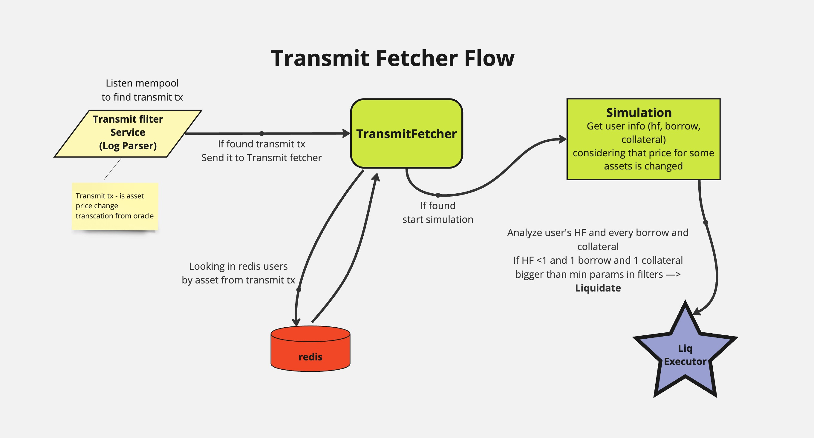

# Liquidation Scanner 

> **Important Notice**: This is a demonstration repository. It is part of my GitHub portfolio intended for job applications. Many parts of the code and configuration have been intentionally removed. The repository showcases my experience with DeFi protocols, MEV Boat, and working expirience with AAVE and Compound protocols

The code is a trimmed-down version of a real project, adapted to be safely published on GitHub for demonstration purposes.
---

[Detailed documentation can be found in the `doc` folder](./doc)

## Doc sections

1. [Run Services](./doc/eng/0_runServices.md)
2. [What is Liquidation](./doc/eng/1_whatIsLiquidation.md)
3. [Project Overview](./doc/eng/2_projectOverview.md)
4. [Service Architecture](./doc/eng/3_serviceArchitecture.md)
5. [Archive](./doc/eng/4_archive.md)
6. [Blacklist](./doc/eng/5_blacklist.md)
7. [Proxy](./doc/eng/6_proxy.md)
8. [Subgraph](./doc/eng/7_subgraph.md)
9. [Data Fetcher](./doc/eng/8_dataFetcher.md)
10. [Transmit Fetcher](./doc/eng/9_transmitFethcer.md)
11. [Events](./doc/eng/10_events.md)
12. [Logger](./doc/eng/11_logger.md)
13. [Simulator](./doc/eng/12_simulator.md)

## Introduction to the Liquidator Service

The Liquidator service is a service that tracks potential positions for liquidations and subsequently liquidates them. Currently, Liquidator operates in DeFi liquidity protocols such as AAVE V1, AAVE V2, AAVE V3, and Compound. The main goal of the project is to identify users who are in the liquidation risk zone and liquidate their positions while making a profit from the liquidations.

# Project Launch

```
Info deleted to show repo on public
```

## Service Dependencies

All services depend on `globalReservesData`, which comes on the topic `data/reserves/` (for example, `data/reserves/V1`). If your services have started but nothing is happening, check if the reason is that `globalReservesData` updates from the `Events` service have not arrived.

Note: Events service is in the repository

## Transmit Fetcher Service Dependency

The Transmit Fetcher service depends on an external service that sends transactions on the topic `listener/transmit`. Service name: `ETH_ImpossibleParser`

Tip: You can subscribe to topics from the terminal to check if transmits are coming:
`mqtt sub -h "<your_mqtt_host>" -t "listener/transmit"`

Note: Transmits come quite rarely, waiting time can be up to 30 minutes.\
**WARN**: Current version of LiqRegistry (V0.0.8) requires customized ImpossibleParser to work properly - sercive expect to receive transmit hash with it's transaction body (TransactionReceipt)

## Log Tracking
> You can track logs anytime with `mqtt sub -h [host] -t [topic]` just choose correct mqtt and topic wich is in you if desired service

For tracking logs on prod or dev infrastructure, the `UniversalLogger.js.log` or `UniversalLogger.js.mongo` service must be running


## Running in debug mode

Running in debug mode is done with the command:
`npm run debug<ServiceName> <Protocol><ServiceName>`
For example:
`npm run debugProxy V1Proxy`

To run the events service in debug mode, you don't need to specify the protocol name, as the service is common for all protocols.
To run events in debug mode
`npm run debugEvents Events`

## Launch Scripts

All launch scripts can be found in `package.json`

## Structure of the Liquidator Service

The Liquidator service consists of two main sub-services:

1. **LiqRegistry**: Responsible for collecting and filtering users who have interacted with supported liquidity protocols. It finds potential positions for liquidation.
2. **LiqExecutor**: Responsible for executing the liquidation of user positions identified by LiqRegistry.

This documentation focuses on describing the business logic of the LiqRegistry service.

## Business Logic of LiqRegistry

LiqRegistry works with liquidity protocols AAVE V1, AAVE V2, AAVE V3, and Compound. The main task of the service is to find users who have taken a loan in any of these protocols and track their Health Factor (an indicator of how close the user is to liquidation), Borrow, and Collateral.

The LiqRegistry process can be divided into three main stages:

1. **Blockchain filtering**: The service filters the entire blockchain to find users who have interacted with one of the four supported protocols.
2. **User filtering**: Found users are filtered based on certain criteria such as minimum loan size (Borrow), minimum collateral size (Collateral), and Health Factor.
3. **Detailed analysis of selected users**: More detailed analysis of certain users. Analysis of their assets in Borrow and Collateral. Also, simulation of Health Factor changes based on price change transactions (Transmit).
4. **Data transfer to LiqExecutor**: After filtering, information about users subject to liquidation is transferred to the LiqExecutor service for liquidation execution.

LiqRegistry is a key component of the Liquidator system, responsible for finding and tracking liquidity protocol users potentially suitable for liquidation. LiqRegistry consists of seven sub-services, each performing a specific role in the process of filtering and monitoring users:

1. **Archive** - collects all users who have ever interacted with each individual protocol, starting from the protocol creation block. Archive also tracks new users in real-time.

2. **Blacklist** - the first stage of filtering users by Health Factor, MinBorrow, and MinCollateral parameters. It filters out users whose parameters are too far from potentially interesting for liquidation.

3. **Proxy** - an auxiliary service for Subgraph that distributes users among Subgraph instances for efficient processing.

4. **Subgraph** - filters users, focusing on those whose Health Factor, MinBorrow, and MinCollateral parameters are close to the possibility of liquidation. Sends filtered users to DataFetcher.

5. **DataFetcher** - makes decisions about liquidating users or adding them to the WatchList for further monitoring based on detailed analysis of their parameters.

6. **TransmitFetcher** - monitors Transmit transactions in the mempool to detect changes in token prices affecting the Health Factor of users from the WatchList, allowing them to be liquidated in the same block where the Health Factor changes.

Additionally, the

7. **Events** service is responsible for monitoring new block outputs, sending these blocks via MQTT, and updating globalReservesData.

All these services work as a single mechanism, gradually narrowing down the list of users at each stage to ultimately identify those most suitable for liquidation and pass these users to the next service, liqExecutor. This approach allows efficient use of limited system resources when working with a large number of liquidity protocol users.

## Services architecture Flow


[Detailed services project overview can be found in the `doc/` folder](./doc/eng/3_serviceArchitecture.md)

## Business Logic of LiqExecutor

After finding positions for liquidation by the LiqRegistry service, LiqExecutor analyzes the possibility of liquidation and potential profit from it, considering possible liquidation paths, gas price for the liquidation transaction, etc.

# User Liquidation and Liquidity Protocols

In the world of decentralized finance (DeFi), liquidity protocols play a crucial role in ensuring the functioning of the ecosystem. These protocols allow users to borrow and lend cryptocurrency assets using smart contracts on the Ethereum blockchain. However, when users' Health Factor falls below a critical level, there is a need to liquidate their positions to protect the protocol and other participants. In this section, we will examine the concept of user liquidation, the role of liquidity protocols such as Aave and Compound, and the importance of tracking potential users for liquidation.

## What is User Liquidation?

User liquidation is a process where anyone can close the position of a user whose Health Factor has fallen below a critical level. When a user takes a loan in a liquidity protocol, they must provide collateral in the form of cryptocurrency assets. If the Health Factor falls below 1, the position becomes available for liquidation.

During liquidation, the liquidator repays the user's debt to the protocol and receives a portion of the user's collateral plus a bonus as a reward. Liquidation is an important mechanism for maintaining the stability and security of liquidity protocols.

## Tracking Potential Users for Liquidation

For the effective functioning of liquidity protocols and protection of liquidity providers, it is important to track potential users who can be liquidated. Projects that deal with this task, can significantly improve the stability and security of the DeFi ecosystem.

Tracking potential users for liquidation involves constant monitoring of the Health Factor, collateral value, and loan amounts of users in real-time. When a user's Health Factor approaches 1 or falls below, liquidator teams can quickly react and perform liquidation.

This approach allows liquidators to more effectively protect liquidity protocols from losses. Additionally, tracking potential users for liquidation provides an opportunity for liquidators to profit from liquidations.

## What is Health Factor (HF)?

Health Factor (HF) is a key indicator in DeFi lending protocols that determines the stability of a user's position. It is calculated as the ratio of collateral value to loan amount, taking into account the liquidation coefficient.


Health Factor can be imagined as a balance, where:

- On one side is the loan amount (Borrow)
- On the other side is the collateral value (Collateral)
- The arrow shows the current HF

When HF = 1, the balance is even. If HF < 1, the position can be liquidated.

- HF decreases when:
  - The loan value increases
  - The collateral value decreases
- HF increases when:
  - The loan value decreases
  - The collateral value increases

## Liquidity Protocols

### Aave

Aave is a decentralized liquidity protocol that allows users to borrow and lend a wide range of cryptocurrency assets. The protocol has three main versions:

1. Aave v1: The first version of the protocol, launched in January 2020. It introduced the concept of liquidity pools and flash loans.

2. Aave v2: The second version, released in December 2020, added new features such as whitelists, delegated lending, and improved gas efficiency.

3. Aave v3: The latest version of the protocol, launched in March 2022. It introduced capital efficiency, isolated liquidity pools, and portals for better compatibility with other blockchains.

Aave uses an auction-based liquidation algorithm where liquidators compete for the right to liquidate a user's position. The protocol also has an incentive system for liquidators, paying them a reward for successful liquidation.

### Compound

Compound is another popular liquidity protocol that allows users to earn interest on their cryptocurrency assets and borrow them. The protocol uses a pool-based model where users deposit their assets into a shared pool and receive cTokens that represent their share in the pool.

When a user takes a loan in Compound, the protocol automatically calculates the liquidation ratio based on the collateral value and loan amount. If the ratio falls below the set threshold, the protocol allows liquidators to close the user's position and receive a reward.

A project tracking potential users for liquidation can work closely with liquidity protocols such as Aave and Compound to ensure effective monitoring and timely notification of liquidators about liquidation opportunities.

## Conclusion

User liquidation is an important aspect of the functioning of liquidity protocols such as Aave and Compound. This mechanism ensures the stability and security of the DeFi ecosystem, protecting protocols and liquidity providers from losses. Tracking potential users for liquidation is a key component of this process, allowing liquidators to quickly react to Health Factor falling below the critical level and more effectively protect protocols.

Understanding the concept of liquidation, the role of liquidity protocols, and the importance of tracking users' Health Factor is crucial for all participants in the DeFi space. Projects that deal with this task can significantly improve the stability, security, and efficiency of the decentralized finance ecosystem.


# Archive

The task of the archive is to collect all users who have ever interacted with each individual protocol.


## How does the archive work?

### 1. Initialization:

- For example, let's consider the AAVE V2 protocol. AAVE V2 was created three years ago on a specific block (e.g., block #11,362,579). We launch the archive service, which has the initial block number specified manually in its configuration (the protocol creation number).

### 2. Scanning Historical Data:

- The archive starts scanning from this block, filtering all interactions with AAVE V2 smart contracts. It analyzes which users and addresses have interacted with the protocol from its creation to the present day.
- During scanning, the archive records all users in Redis.

### 3. Current State:

- As of now, the archive has collected approximately 30 thousand users in Compound, 18 thousand in AAVE V3, 54 thousand in AAVE V2, and 10 thousand in AAVE V1.

### 4. Monitoring New Users in Real-Time:

- The archive also checks for new users in real-time. Each new block comes from the Events service, and if it contains user interactions with the protocol, this information is also recorded in Redis.

This process allows us to maintain an up-to-date list of users for further tracking of their Health Factor and other parameters.

It's also important to keep in mind that to scan users in past blocks, we need an archive full Ethereum node. Nodes like Infura or Alchemy usually only store the previous few dozen blocks (except paid subscriptions or special providers). However, if Redis is filled with users, a cloud node can be used to monitor new users in real-time.


# Blacklist

Blacklist is the first sub-service for filtering by Health Factor (HF), MinBorrow, and MinCollateral in the LiqRegistry system. The main task of this service is to filter out users whose HF, MinBorrow, and MinCollateral values are too far from potentially interesting for liquidation, and add them to the blacklist.

> **Note:** This service is important. However, liqRegistry can work without it. In this case, the number of users on Subgraph will simply increase. However, for optimal speed in production, it's strongly recommended to run the blacklist as well.

## Main Principles of Blacklist Operation

### 1. Initialization:

- When Blacklist starts, there should already be a user database collected by the Archive sub-service. This ensures data availability for further filtering. However, it's not necessary to wait until the user database is completely filled. In the next cycle, when the number of users increases, Blacklist will update its user list.

### 2. User Filtering:

- The Blacklist service takes all users from the Archive database and checks their data:
  - Health Factor (HF): If a user's HF is too high (e.g., more than 10) or too low, they are added to the blacklist.
  - Minimum Borrow Amount (MinBorrow): If the Borrow is too small, the user is added to the blacklist.
  - Minimum Collateral (MinCollateral): If the Collateral is too small, the user is added to the blacklist.
- For example, if a user has an HF greater than 10, it means that the conditions for liquidating this user are unlikely to be met soon, so there's no point in monitoring them with more focused services (Subgraph).

### 3. Circular Scanning:

- Blacklist operates in a circular scanning mode (the Proxy + Subgraph combination also works in this mode), meaning the service continuously scans and checks users. After a complete scanning cycle, Blacklist starts the circle anew.

### 4. Adding to Blacklist:

- Depending on the check results, the service decides whether to add a user to the blacklist or not. Blacklist's task is to have a list of users worth working with, i.e., those whose HF, MinBorrow, and MinCollateral parameters are "interesting" for further processing.

### 5. Scanning Time:

- Most of our services use a simulator to obtain user data. Currently, all services use one simulator instance. Since our task is to get the fastest response from the simulator for other services, we artificially slow down Blacklist (see parameter: "delayBetweenRequestsToSimulator": 5000 (ms)).
- Currently, Blacklist completes a scanning cycle in about an hour and a half for the protocol with the largest number of users. Without artificial limitation, the service can complete scanning in 10 minutes.

## Conclusion

Blacklist provides effective initial filtering of users who do not meet the necessary criteria, allowing focus on those worth working with further. The service constantly maintains an up-to-date list of users for further processing in the LiqRegistry system.


### Proxy

Proxy is an auxiliary service for Subgraph. It emerged from the need to efficiently distribute users among multiple Subgraph instances.

#### History

Our Cinnamon architecture allows running each service in multiple fork mode. For example, Subgraph can be launched with 10, 20, or more forks to increase performance. Proxy's task was to efficiently distribute users among these forks. However, after optimization and transition to using a Rust-written simulator (Rust = fast:) instead of a regular Ethereum node, the speed increased significantly, and now all services operate in single fork mode. Therefore, there's no need to run multiple Subgraph instances.

However, currently, the interaction between Proxy and Subgraph services is very well debugged and works efficiently. But the combination of Proxy and Subgraph allows us to reduce the scanning circle in the future by running multiple forks using different simulator instances.

#### Main Principles of Proxy Operation

1. **Initialization**:

   - Proxy retrieves all users from Archive. For example, the Compound protocol has 50 thousand users.
   - Proxy checks which of these users are in Blacklist and which are not. For instance, if out of 50 thousand users, 10 thousand are not in Blacklist, Proxy sends these users to Subgraph for further processing.

2. **User Distribution**:

   - Proxy sends users to Subgraph in batches. The batch size can be set in the settings (currently it's 30 users).
   - Important: The entire batch goes for verification in the simulator. The simulator has a limit on the maximum gas size and cannot process more than 30-40 users. Therefore, don't set the batch size larger than 30-40. A small batch size will just slow down the service. Note: For debugging the Subgraph service, it's convenient to set the batch size to 1 user.
   - If 10 Subgraph forks are running, and there are 10,000 non-Blacklist users, Proxy evenly distributes users among all forks. That is, 1,000 users will be sent to each fork. So 30 users to the first fork, 30 to the second, until all 10000/30 = 334 batches are sent, 33-34 batches to each fork.

3. **Processing and Feedback**:

   - Proxy sends users to Subgraph in a matter of seconds. And then users enter the queue in the Subgraph service. After processing all users, Subgraph sends a signal (event drain) to Proxy, indicating the completion of processing and readiness to receive new batches.
   - Proxy retrieves an updated list of users on each subsequent circle, taking into account possible changes in Archive or Blacklist, and sends the next batch of users to Subgraph.

   

4. **Launch and Configuration**:
   - Subgraph should always be launched before Proxy, otherwise Proxy will simply send users into the void, and we won't receive a drain event.
   - Protection: If Proxy doesn't receive an event drain within an hour (parameter "SEND_WITHOUT_DRAIN_TIMEOUT": 3600000 (ms)), Proxy will send batches to Subgraph. This provides protection in case only the Subgraph service is restarted in production without Proxy. Don't set the SEND_WITHOUT_DRAIN_TIMEOUT parameter too small, otherwise it may create a problem of accumulating too many users in Subgraph instances. A value of 3600000 (ms) is quite safe, as currently Subgraph completes a circle in 90 seconds.


### Subgraph

Subgraph is a service that filters users for further liquidation. Subgraph focuses on users with HF, MinBorrow, and MinCollateral values close to liquidation possibility. Its main task is to filter users and, if their HF is close to liquidation, send them to DataFetcher.

#### Main Principles of Subgraph Operation

1. **Initialization**:

   - Subgraph receives users from Proxy for further filtering.

2. **User Filtering**:

   - Subgraph filters users with Health Factor (HF) parameters from 0.5 to 2 (input filters). Users with significantly higher or lower HF were rejected at the Blacklist stage.
   - Filter settings in Subgraph are close to potential liquidations. For example, HF in Subgraph is filtered from 0.9 to 1.1 (output filters).

3. **Processing and Circle Completion Speed**:

   - If there are 10 thousand users on the Compound protocol, a circle is the time it takes to process all these users.
   - On our production service, a circle in Subgraph takes about 1.5 minutes, which is a very good result.

4. **Interaction with DataFetcher**:

   - Subgraph sends users to DataFetcher for final decision on liquidation. For example, if a user has HF 0.95, Subgraph sends them to DataFetcher in the execute/liquidate topic to calculate the profitability of liquidation.
   - DataFetcher can only liquidate users that Subgraph sends to it in real-time. Therefore, the speed of processing the user circle by the Subgraph service is very important.

5. **Circle Scanning**:
   - If a user's parameters remain within the Subgraph's output filters (for example, HF 0.95), they will be constantly sent to DataFetcher until they are liquidated or until their parameters go beyond the filters.

## Conclusion

Subgraph provides accurate and fast filtering of users for further liquidation, taking into account all necessary parameters. The service is somewhat similar to Blacklist, but the speed of filtering is important for it.


# DataFetcher

DataFetcher is one of the final services in the system. Its main task is to make decisions about liquidating users or adding them to the WatchList for further monitoring. DataFetcher works together with Subgraph and can be both a final service and pass users to TransmitFetcher for further processing by adding users to the Redis Watchlist.

## Main principles of DataFetcher operation


### 1. Initialization:

- DataFetcher accepts users only from the Subgraph service. It does not have mechanisms for reading users (at the input) from databases (Redis).
- However, DataFetcher has a mechanism for working with Redis at the output. After processing users, DataFetcher decides whether to add users to the WatchList in Redis or not.

### 2. User analysis:

- DataFetcher analyzes the user's HF, as well as all tokens that are in the user's Borrow and Collateral. It selects the largest token for liquidation (Best Borrow and Best Collateral), as we can only liquidate one Borrow and one Collateral per user.
- For example, at the Subgraph stage, we check MinBorrow and MinCollateral for users. If the MinBorrow value is 0.1 ETH, Subgraph passes the user further to DataFetcher. However, DataFetcher checks all tokens of the user and may see that the user has three tokens in Borrow. It selects the largest token for liquidation.
- If the largest of these Borrows is less than MinBorrow (for example, less than 0.1 ETH), such a user will not be liquidated.

### 3. Filters in parameters:

- MinHfDel and MaxHfDel: If DataFetcher sees that the user's Health Factor is less than MinHfDel or greater than MaxHfDel, it removes such a user from the WatchList.
- MinHfLiq and MaxHfLiq: If the user's Health Factor is between MinHfLiq and MaxHfLiq, the user will be sent for liquidation. For example, if MaxHfLiq = 1 and MaxHfDel = 1.2, it means that if the user's Health Factor is from 1 to 1.2, they will remain in the WatchList. If it's more than 1.2, the user will be removed from the WatchList.
- MinBorrow and MinCollateral: Unlike Subgraph, where MinBorrow and MinCollateral mean Total MinBorrow (total borrow value across all tokens in the user's borrow), in DataFetcher these parameters define the value for one largest borrow and one largest collateral.

### 4. Decision making:

- If a user is suitable for liquidation (for example, Health Factor < 1), DataFetcher sends a liquidate event (execute/liquidator/${protocol}) to LiqExecutor.
- If a user is not suitable for liquidation, DataFetcher adds them to the WatchList in Redis for further monitoring. For example, if the user's Health Factor > 1 or their minimum Borrow/Collateral is not suitable for liquidation, DataFetcher adds them to the WatchList.
- DataFetcher also removes users from the WatchList if their parameters have changed and they no longer meet the criteria for monitoring or liquidation.

### 5. Monitoring and updating:

- Users from the WatchList will be monitored by TransmitFetcher.
- DataFetcher constantly checks users coming from Subgraph and takes appropriate actions (for example, liquidation or removal from the WatchList).

## Note

As described in the Subgraph section, if a user meets the liquidation criteria (for example, Health Factor 0.95), Subgraph will constantly send this user to DataFetcher every one and a half minutes until the user is liquidated. Therefore, DataFetcher may often receive the same user. If DataFetcher decides not to liquidate this user, they will still pass on the next step from Subgraph.

## Conclusion

DataFetcher provides detailed user analysis and makes decisions about their liquidation or addition to the WatchList for further monitoring. Its functionality allows checking each individual borrow and collateral of the user. And based on their parameters, it sends users for liquidation or adds them to the Watchlist for further observation by the TransmitFetcher service.


# TransmitFetcher

TransmitFetcher is a service that listen Transmit transactions in the mempool to detect changes in token prices that are in the user's borrow or collateral, affecting users' Health Factor. TransmitFetcher allows liquidating a user in the same block where their Health Factor changes. In essence, it's like looking into the future by one block.



## What is Transmit:

- Transmit is a transaction from the Chainlink Oracle provider that informs the liquidity protocol about a change in asset price. It is necessary for the smooth operation of liquidity protocols.
- Example of operation: if ETH costs $4000 now, and in an hour ETH costs $3950, then in an hour Transmit sends the new price to the liquidity protocol.
- Impact on Health Factor: if a user borrowed WrapedBTC and put WrapedETH as collateral, a change in the price of WrapedBTC or WrapedETH will affect their Health Factor.
- Frequency: Transmit comes at a certain interval (for example, once an hour) or with significant price changes, and transmits the new token price to the liquidity protocol.

## TransmitFetcher Operating Principles:

### 1. Transmit Monitoring:

- TransmitFetcher listens to Transmit transactions that come from another service (logParser) that filters the entire mempool.
- TransmitFetcher checks whether Transmit relates to its protocol (V1, V2, V3, Compound) and which tokens are changing in price.

### 2. User Analysis:

- TransmitFetcher retrieves from WatchList all users who have the mentioned token in Borrow or Collateral.
- For each user, it simulates a transaction taking into account the Transmit transaction, i.e., considering the price change. This allows obtaining a new Health Factor at the mempool stage before inclusion in the block.

### 3. Decision Making:

- If a user's new Health Factor < 1, TransmitFetcher sends a liquidate event to LiqExecutor.
- TransmitFetcher checks all tokens in Borrow and Collateral for the user before making a liquidation decision.
- TransmitFetcher does not write or delete users from WatchList, it only retrieves users from WatchList for analysis. The DataFetcher service handles writing and deleting users from WatchList.


### 4. Advantages of TransmitFetcher:

- The largest and most profitable liquidations occur precisely through TransmitFetcher, as it monitors the mempool and can predict price changes.

## Conclusion

TransmitFetcher provides monitoring and analysis of changes in token prices that affect users' Health Factor. Its main task is to timely identify users who can be liquidated and transmit this information for further action.


# Events

Events is one of the critically important services in the Liquidator structure, which performs two main functions: monitoring new blocks and monitoring GlobalReservesData.


## Functions of the Events service

### 1. Monitoring new blocks:

- The Events service tracks the appearance of new blocks in the blockchain.
- Each time a new block appears, the service sends an MQTT message to the Topic `data/block` to all other services that need this information, for example, the Archive service.
- This allows all interested services to receive information about new blocks in a timely manner and not to load the ETH node with their own requests.

### 2. Monitoring GlobalReservesData:

- Service Events is also responsible for monitoring and updating GlobalReservesData.
- GlobalReservesData contains critically important information about tokens used by our liquidity protocols.
- Each entry in GlobalReservesData includes the following fields:
  - List of ERC20 tokens.
  - Decimals: number of decimal places for each token.
  - Price: token price relative to ETH or USD (for AAVE V1 and AAVE V2 protocols, the price is indicated to ETH, for AAVE V3 and Compound - to USD).
  - Bonus: percentage of bonus that the protocol provides for liquidating certain positions on specific tokens.

## Importance of GlobalReservesData

GlobalReservesData is critically important for the functioning of the Liquidator system. Here's why:

1. **Calculation of MinBorrow and MinCollateral**: These parameters are always expressed in ETH or USD. To calculate correctly, it is necessary to know the current price of each token. For example, if we have a UNI token in borrow, then to know the value of borrow in USD, we need to know how much UNI costs in USD. This information is contained in GlobalReservesData.

2. **Diversity of protocols**: Each protocol has its unique set of tokens, so GlobalReservesData differs for each protocol. For example:

   - AAVE V3 may have a list of 21 tokens
   - Compound may have 15 tokens, partially different from AAVE

3. **Critical importance for services**: Without up-to-date GlobalReservesData, some services cannot function correctly or even start.

   The following services will not start without GlobalReservesData:

   - Blacklist
   - Subgraph
   - DataFetcher
   - TransmitFetcher

   In addition, the Archive service will not work correctly without information about the release of new blocks. This data is sent by the Events service.

4. **Data relevance**: GlobalReservesData provides all services with up-to-date information about token prices, which is critical for correctly calculating user positions and making liquidation decisions.

## Operating modes of Service Events

Service Events can operate in two modes depending on the type of connection to the Ethereum node:

### 1. WebSocket:

- Connecting to the Ethereum node via WebSockets allows receiving data in real-time.
- This reduces the load on the node and ensures fast information transmission.

### 2. HTTP:

- Connecting to the Ethereum node via HTTP allows making constant requests at a certain interval (for example, every 10 ms).
- Although there is a theory that HTTP requests can be faster, some experiments have shown that this is not always the case.
- Timeout parameters can be adjusted depending on needs.

GlobalReservesData is sent separately for each protocol, for example `data/reserves/V1`, since each protocol has its specific set of tokens. This ensures the accuracy and relevance of the data needed to calculate the position price.

## Example of globalReservesData:

```json
{
  "0x6B175474E89094C44Da98b954EedeAC495271d0F": {
    "price": {
      "type": "BigNumber",
      "hex": "0x010ebb1fcaa438"
    },
    "decimals": {
      "type": "BigNumber",
      "hex": "0x12"
    },
    "bonus": {
      "type": "BigNumber",
      "hex": "0x69"
    }
  },
  "0x0000000000085d4780B73119b644AE5ecd22b376": {
    "price": {
      "type": "BigNumber",
      "hex": "0x010e2dda4f252a"
    },
    "decimals": {
      "type": "BigNumber",
      "hex": "0x12"
    },
    "bonus": {
      "type": "BigNumber",
      "hex": "0x69"
    }
  }
}
```

Note: You can check if globalReservesData is coming to your service by subscribing to one of the topics from the terminal.
For example:

`mqtt sub -h "10.10.100.87" -t "data/reserves/V1"`

## Conclusion

The Events service provides reliable and timely transmission of critically important information, allowing the entire Liquidator system to operate efficiently and without interruption.


### Logging


#### General Description

In our system, each service sends necessary logs to a separate logging service (logger). Log sending is done using the `logger/liquidator` topic. The main purpose of logging is to monitor and analyze service actions, particularly user filtering and liquidation.

#### Logging Purpose

Although error logs are also sent to the logger, the main task of logging is as follows:

1. **Viewing liquidated users:**

   - User liquidation: Monitoring the process of successful user liquidations. If a user was not liquidated, the logger allows determining at which stage of the process they were skipped.

2. **Finding the reason why liquidation did not occur:**

   - Analysis of each service's load, circle completion time on each server, measuring time for each operation. Also, in the logs, you can find all users that we have on each protocol.

3. **Logging errors**
   - Logging errors, diagnosing problems, ensuring data integrity.

#### Data Logging

Logging occurs in the root service using the `fetcher.on` method. This method takes two parameters:

- `data`: Information for logging.
- `ev` (optional): Event name. If this parameter is not specified, the default value `INFO` is used.

Usage example:

```javascript
fetcher.on("info", (data, ev = INFO) => {
  $.send("info", {
    service,
    protocol,
    ev,
    data: JSON.stringify(data),
  })
})
```

#### List of Liquidated Positions

The list of liquidated positions can be viewed on the EigenPhi website [EigenPhi](https://eigenphi.io/mev/ethereum/liquidation). Just copy the user's "borrower" address, open the log files using VS Code, and paste the address into the global search. This way, you'll see if liquidation occurred. And if it didn't occur, at which stage it didn't happen.

**Tips for viewing logs in VS Code::**

1. If you have too many logs, you can increase the search limit in VS Code from 20000 to 1000000, for example.
2. Log files are very heavy (a file for 1 hour can weigh up to 100 MB). If viewing files directly on the log server takes too long, you can download the logs to your computer (at night, for example) and view them locally. You can use the `rsync` command for this.

#### Using the `this.emit` Command

The `this.emit("info", message, ev="SIMULATION_ERROR")` command is used for logging. `ev` is the event name sent to the logger.

`this.emit` is available in all service subclasses. Don't hesitate to use it.

**Important addition:**
Keep in mind that `this.emit("info")` or `this.emit("error")` is used for logging, and their deletion or replacement will not affect the service operation, only the logs. However, in the service code, there are also service methods, for example `this.emit("fetch")` or `this.emit("sendUserToDataFetcher")` - their thoughtless change or deletion will break the service operation. Don't fall for this, because these are the rakes I've stepped on several times!


# Simulator

## Description

The simulator is a utility used in LiqRegistry to perform two main functions.

## Main Functions

### 1. Simulation of Future Transactions

- Used in TransmitFetcher to simulate a user's HealthFactor in the next block.
- Simulation occurs alongside the transmit transaction.

### 2. Data Retrieval

- Performs functions similar to GET methods in a regular Ethereum node.
- Used to obtain user data (e.g., through getUserAccountData).
- Chosen over a node due to high speed, stability, and ability to handle a larger request flow.

## Services Using the Simulator

- **Blacklist**: Data retrieval via getUserAccountData.
- **Subgraph**: Data retrieval via getUserAccountData.
- **DataFetcher**: Data retrieval via getUserAccountData.
- **TransmitFetcher**: Data retrieval and transaction simulation.
- **Events**: Does not use the simulator, uses a regular Ethereum node.
- **Archive**: Does not use the simulator, uses a regular Ethereum node.

## Using the Simulator

- Service classes for interaction are located in the `lib/simulator` folder.
- Each service has parameters in Params:
  - **StateOverrides**: Smart contract bytecode.
  - **FormatTrace**: Responsible for returning extended logs (recommended to set to False for faster operation).
  - **Contract Address**: Can be any (used for simulation).

## Additional Information

- Some services have a "useSimulatorInsteadOfNode" parameter.
- This parameter allows switching between the simulator and the node.
- The parameter is available in Blacklist and DataFetcher, but not in Subgraph.

## Example Code in params

```json
{
  "useSimulatorInsteadOfNode": true,
  "formattedTrace": false,
  "simulationContract": "0xF50024f746D94F144a79003D00000000e380A500",
  "stateOverrides": {
    "0xF50024f746D94F144a79003D00000000e380A500": {
      "code": "0x608080604052600436101561001357600080fd5b600324324u23i40x60808060405260043610156100135..." // big hex data
    }
  }
}
```
