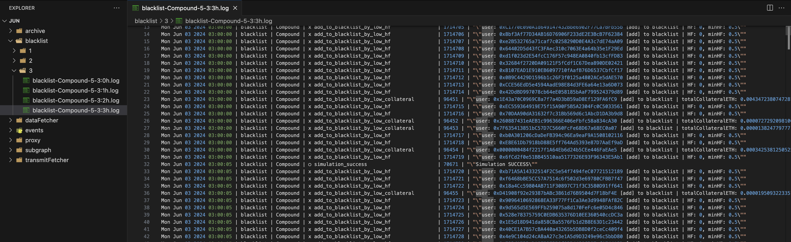

### Logging



#### General Description

In our system, each service sends necessary logs to a separate logging service (logger). Log sending is done using the `logger/liquidator` topic. The main purpose of logging is to monitor and analyze service actions, particularly user filtering and liquidation.

#### Logging Purpose

Although error logs are also sent to the logger, the main task of logging is as follows:

1. **Viewing liquidated users:**

   - User liquidation: Monitoring the process of successful user liquidations. If a user was not liquidated, the logger allows determining at which stage of the process they were skipped.

2. **Finding the reason why liquidation did not occur:**

   - Analysis of each service's load, circle completion time on each server, measuring time for each operation. Also, in the logs, you can find all users that we have on each protocol.

3. **Logging errors**
   - Logging errors, diagnosing problems, ensuring data integrity.

#### Data Logging

Logging occurs in the root service using the `fetcher.on` method. This method takes two parameters:

- `data`: Information for logging.
- `ev` (optional): Event name. If this parameter is not specified, the default value `INFO` is used.

Usage example:

```javascript
fetcher.on("info", (data, ev = INFO) => {
  $.send("info", {
    service,
    protocol,
    ev,
    data: JSON.stringify(data),
  })
})
```

#### List of Liquidated Positions

The list of liquidated positions can be viewed on the EigenPhi website [EigenPhi](https://eigenphi.io/mev/ethereum/liquidation). Just copy the user's "borrower" address, open the log files using VS Code, and paste the address into the global search. This way, you'll see if liquidation occurred. And if it didn't occur, at which stage it didn't happen.

**Tips for viewing logs in VS Code::**

1. If you have too many logs, you can increase the search limit in VS Code from 20000 to 1000000, for example.
2. Log files are very heavy (a file for 1 hour can weigh up to 100 MB). If viewing files directly on the log server takes too long, you can download the logs to your computer (at night, for example) and view them locally. You can use the `rsync` command for this.

#### Using the `this.emit` Command

The `this.emit("info", message, ev="SIMULATION_ERROR")` command is used for logging. `ev` is the event name sent to the logger.

`this.emit` is available in all service subclasses. Don't hesitate to use it.

**Important addition:**
Keep in mind that `this.emit("info")` or `this.emit("error")` is used for logging, and their deletion or replacement will not affect the service operation, only the logs. However, in the service code, there are also service methods, for example `this.emit("fetch")` or `this.emit("sendUserToDataFetcher")` - their thoughtless change or deletion will break the service operation. Don't fall for this, because these are the rakes I've stepped on several times!
