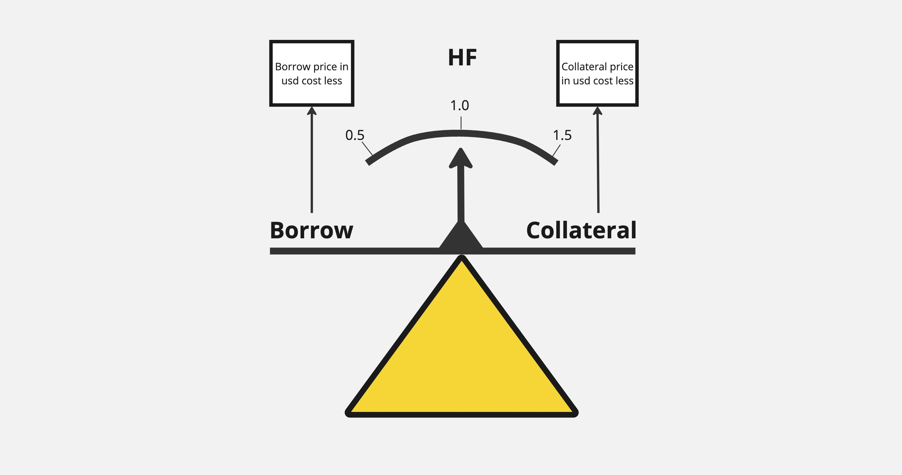

# User Liquidation and Liquidity Protocols

In the world of decentralized finance (DeFi), liquidity protocols play a crucial role in ensuring the functioning of the ecosystem. These protocols allow users to borrow and lend cryptocurrency assets using smart contracts on the Ethereum blockchain. However, when users' Health Factor falls below a critical level, there is a need to liquidate their positions to protect the protocol and other participants. In this section, we will examine the concept of user liquidation, the role of liquidity protocols such as Aave and Compound, and the importance of tracking potential users for liquidation.

## What is User Liquidation?

User liquidation is a process where anyone can close the position of a user whose Health Factor has fallen below a critical level. When a user takes a loan in a liquidity protocol, they must provide collateral in the form of cryptocurrency assets. If the Health Factor falls below 1, the position becomes available for liquidation.

During liquidation, the liquidator repays the user's debt to the protocol and receives a portion of the user's collateral plus a bonus as a reward. Liquidation is an important mechanism for maintaining the stability and security of liquidity protocols.

## Tracking Potential Users for Liquidation

For the effective functioning of liquidity protocols and protection of liquidity providers, it is important to track potential users who can be liquidated. Projects that deal with this task, can significantly improve the stability and security of the DeFi ecosystem.

Tracking potential users for liquidation involves constant monitoring of the Health Factor, collateral value, and loan amounts of users in real-time. When a user's Health Factor approaches 1 or falls below, liquidator teams can quickly react and perform liquidation.

This approach allows liquidators to more effectively protect liquidity protocols from losses. Additionally, tracking potential users for liquidation provides an opportunity for liquidators to profit from liquidations.

## What is Health Factor (HF)?

Health Factor (HF) is a key indicator in DeFi lending protocols that determines the stability of a user's position. It is calculated as the ratio of collateral value to loan amount, taking into account the liquidation coefficient.

Health Factor can be imagined as a balance, where:

- On one side is the loan amount (Borrow)
- On the other side is the collateral value (Collateral)
- The arrow shows the current HF

When HF = 1, the balance is even. If HF < 1, the position can be liquidated.

- HF decreases when:
  - The loan value increases
  - The collateral value decreases
- HF increases when:
  - The loan value decreases
  - The collateral value increases

## Liquidity Protocols

### Aave

Aave is a decentralized liquidity protocol that allows users to borrow and lend a wide range of cryptocurrency assets. The protocol has three main versions:

1. Aave v1: The first version of the protocol, launched in January 2020. It introduced the concept of liquidity pools and flash loans.

2. Aave v2: The second version, released in December 2020, added new features such as whitelists, delegated lending, and improved gas efficiency.

3. Aave v3: The latest version of the protocol, launched in March 2022. It introduced capital efficiency, isolated liquidity pools, and portals for better compatibility with other blockchains.

Aave uses an auction-based liquidation algorithm where liquidators compete for the right to liquidate a user's position. The protocol also has an incentive system for liquidators, paying them a reward for successful liquidation.

### Compound

Compound is another popular liquidity protocol that allows users to earn interest on their cryptocurrency assets and borrow them. The protocol uses a pool-based model where users deposit their assets into a shared pool and receive cTokens that represent their share in the pool.

When a user takes a loan in Compound, the protocol automatically calculates the liquidation ratio based on the collateral value and loan amount. If the ratio falls below the set threshold, the protocol allows liquidators to close the user's position and receive a reward.

A project tracking potential users for liquidation can work closely with liquidity protocols such as Aave and Compound to ensure effective monitoring and timely notification of liquidators about liquidation opportunities.

## Conclusion

User liquidation is an important aspect of the functioning of liquidity protocols such as Aave and Compound. This mechanism ensures the stability and security of the DeFi ecosystem, protecting protocols and liquidity providers from losses. Tracking potential users for liquidation is a key component of this process, allowing liquidators to quickly react to Health Factor falling below the critical level and more effectively protect protocols.

Understanding the concept of liquidation, the role of liquidity protocols, and the importance of tracking users' Health Factor is crucial for all participants in the DeFi space. Projects that deal with this task can significantly improve the stability, security, and efficiency of the decentralized finance ecosystem.
