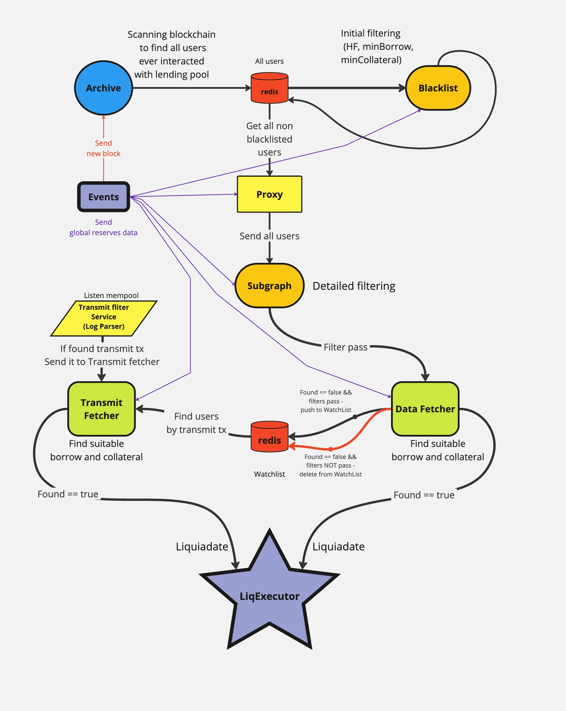

# General Overview of the Liquidator Service



## Introduction

The Liquidator service is a service that tracks potential positions for liquidations and subsequently liquidates them. Currently, Liquidator operates in DeFi liquidity protocols such as AAVE V1, AAVE V2, AAVE V3, and Compound. The main goal of the project is to identify users who are in the liquidation risk zone and liquidate their positions while making a profit from the liquidations.

## Structure of the Liquidator Service

The Liquidator service consists of two main sub-services:

1. **LiqRegistry**: Responsible for collecting and filtering users who have interacted with supported liquidity protocols. It finds potential positions for liquidation.
2. **LiqExecutor**: Responsible for executing the liquidation of user positions identified by LiqRegistry.

This documentation focuses on describing the business logic of the LiqRegistry service.

## Business Logic of LiqRegistry

LiqRegistry works with liquidity protocols AAVE V1, AAVE V2, AAVE V3, and Compound. The main task of the service is to find users who have taken a loan in any of these protocols and track their Health Factor (an indicator of how close the user is to liquidation), Borrow, and Collateral.

The LiqRegistry process can be divided into three main stages:

1. **Blockchain filtering**: The service filters the entire blockchain to find users who have interacted with one of the four supported protocols.
2. **User filtering**: Found users are filtered based on certain criteria such as minimum loan size (Borrow), minimum collateral size (Collateral), and Health Factor.
3. **Detailed analysis of selected users**: More detailed analysis of certain users. Analysis of their assets in Borrow and Collateral. Also, simulation of Health Factor changes based on price change transactions (Transmit).
4. **Data transfer to LiqExecutor**: After filtering, information about users subject to liquidation is transferred to the LiqExecutor service for liquidation execution.

LiqRegistry is a key component of the Liquidator system, responsible for finding and tracking liquidity protocol users potentially suitable for liquidation. LiqRegistry consists of seven sub-services, each performing a specific role in the process of filtering and monitoring users:

1. **Archive** - collects all users who have ever interacted with each individual protocol, starting from the protocol creation block. Archive also tracks new users in real-time.

2. **Blacklist** - the first stage of filtering users by Health Factor, MinBorrow, and MinCollateral parameters. It filters out users whose parameters are too far from potentially interesting for liquidation.

3. **Proxy** - an auxiliary service for Subgraph that distributes users among Subgraph instances for efficient processing.

4. **Subgraph** - filters users, focusing on those whose Health Factor, MinBorrow, and MinCollateral parameters are close to the possibility of liquidation. Sends filtered users to DataFetcher.

5. **DataFetcher** - makes decisions about liquidating users or adding them to the WatchList for further monitoring based on detailed analysis of their parameters.

6. **TransmitFetcher** - monitors Transmit transactions in the mempool to detect changes in token prices affecting the Health Factor of users from the WatchList, allowing them to be liquidated in the same block where the Health Factor changes.

Additionally, the

7. **Events** service is responsible for monitoring new block outputs, sending these blocks via MQTT, and updating globalReservesData.

All these services work as a single mechanism, gradually narrowing down the list of users at each stage to ultimately identify those most suitable for liquidation and pass these users to the next service, liqExecutor. This approach allows efficient use of limited system resources when working with a large number of liquidity protocol users.

Each service has its own `filters` which specify parameters for selection. As they pass through the funnel, the filters narrow to weed out irrelevant users for liquidation.

```javascript
    "min_collateral_amount": 0.01,
    "min_borrow_amount": 0.01,
    "min_health_factor": 0.5,
    "max_health_factor": 1.8
```

You can find detailed operation of each service in separate subsections of the documentation.

## Business Logic of LiqExecutor

After finding positions for liquidation by the LiqRegistry service, LiqExecutor analyzes the possibility of liquidation and potential profit from it, considering possible liquidation paths, gas price for the liquidation transaction, etc.


# Service Architecture

## Introduction

The architecture of our project is based on the Cinnamon system, which is used by most projects in our company. This architecture involves the use of certain patterns and standards that help ensure uniformity and efficiency of all services.

#### Configuration Files

##### Global Configurations

All global configurations are stored in the `configs/main.json` file. This file contains:

- URL and port for Redis
- Links to Ethereum node
- Other general variables necessary for the operation of services

##### Service Configurations

Each project has its own configurations, which are stored in the `configs/workers` folder. The main configuration file for each project is named `<serviceName>services.json`, for example: `blacklistServices.json`. This file defines:

- `Default Settings` object, which contains shared settings for all protocols
- Settings for individual protocols (AAVE V1, AAVE V2, AAVE V3, Compound). Here, a parameter hierarchy works. If some settings are specified in `Default Settings`, they are used first. But if some parameter is specified in a specific protocol, for example `V1`, then these settings will be higher in the hierarchy. This is done to avoid parameter duplication.

##### MQTT Communication

The `sys.config.json` file specifies the URL for communication via MQTT topics. All services of our company, including liquidation services, work through MQTT, sending messages to each other with certain topics. Each service has defined topics for sending (`Notify`) and listening (`Listen`).

##### REDIS - Main Database

In the early versions, PostgreSQL was used as the main database. Now, the only database of the project is Redis.
All `redis namespaces` are specified in the `configs/redisNamespaces.js` file

##### Example of Topic Configuration

The configuration files of each service specify the `Notify` and `Listen` parameters. For example, in the `services.json` file:

```json
    "listen": {
      "onReservesData": {
        "topic": "data/reserves/V1",
        "roundrobing": false
      }
    },
    "notify": {
      "drain": {
        "topic": "event/drain/subgraph/V1"
      }
    },
```

##### Service Instances

All services are launched in four instances for each protocol (AAVE V1, AAVE V2, AAVE V3, Compound). For example, you can launch the entire system (archive, proxy, subgraph, data fetcher, and transmit) for just one protocol, for example, V1.

#### Folder Structure

##### Systems Folder

This is the main folder that contains files responsible for the operation of our system's architecture.

##### Configs Folder

All configuration files are stored here.

##### Services Folder

Contains entry points for each service.

##### Lib Folder

Contains all auxiliary libraries. The `lib/services` folder stores all working files of certain projects. For example, the `subgraph` project has its own separate folder with settings and description, which is located in `lib/services/subgraph`

#### OOP Patterns

All services are built according to the principles of object-oriented programming (OOP). For example:

- **fetcher.js** – main class for handlers
- **fetcher-aave.js** – class for AAVE, which
- **fetcher-aave-v1.js**, **fetcher-aave-v1.js**, **fetcher-aave-v1.js** – classes for different versions of AAVE that inherit from **fetcher-aave.js**
- **fetcher-compound.js** – class for the compound protocol, which inherits directly from the main class **fetcher.js**

#### Queue Mechanism

Some of our services, such as Blacklist and Subgraph, have a queue mechanism. The purpose of the queue is to smooth out peak loads that come to the service. For example, the Proxy service sends tens of thousands of users to Subgraph in a few seconds. Subgraph adds these users to the queue and then processes them one by one or in groups, in queue order. After processing, the queue initiates an `emit` event - which notifies that the queue is empty.

#### Using Forks

##### What are Forks

Each service can operate in multiple forks mode, i.e., simultaneous launch of multiple instances. This can be useful for load distribution and improving service performance. However, currently, there's no point in launching all services in multiple forks mode. This makes sense only for the Subgraph service, especially when one protocol (for example, AAVE V2) needs to work with several independent simulator instances. If you launch services in multiple forks mode but use the same simulator instance, you won't achieve any speed improvement.
Currently, we've achieved such service speed that it works optimally in `forks=1` mode.

##### Fork Parameters

In the service configuration files, you can specify the `forks` and `roundrobing` parameters:

- **forks** – number of simultaneous service instances. For example, if `forks=2`, the service will be launched in two instances.
- **roundrobing** – parameter that determines how data is distributed between instances:
  - **true** – data from MQTT comes to instances in turn. For example, if 2 Subgraph instances are running, Proxy will send the first 30 users to the first instance, and the next 30 to the second instance.
  - **false** – data comes to each instance in parallel. For example, Proxy will send 30 users to each instance simultaneously.


## Conclusion

The project architecture is built on the Cinnamon system and uses standardized templates to ensure uniformity and efficiency of operation. Each service has its own configuration files that define input and output points, as well as parameters for interaction with other services via MQTT. The queue mechanism helps smooth peak loads, ensuring stable service operation. Services are launched through PM2, which ensures stability, background operation, and ease of process management. Fork mode, in theory, allows scaling services to increase productivity.
