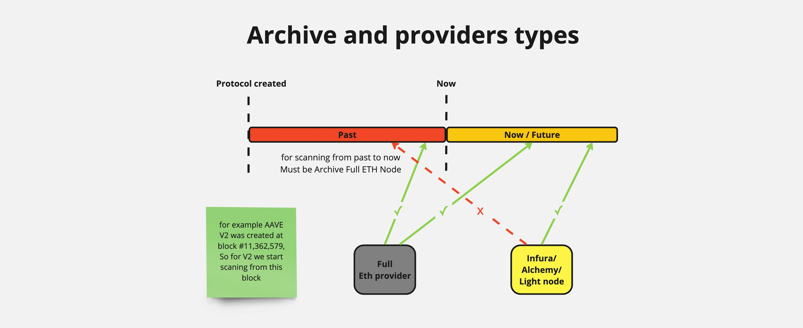

# Archive

The task of the archive is to collect all users who have ever interacted with each individual protocol.

## How does the archive work?

### 1. Initialization:

- For example, let's consider the AAVE V2 protocol. AAVE V2 was created three years ago on a specific block (e.g., block #11,362,579). We launch the archive service, which has the initial block number specified manually in its configuration (the protocol creation number).

### 2. Scanning Historical Data:

- The archive starts scanning from this block, filtering all interactions with AAVE V2 smart contracts. It analyzes which users and addresses have interacted with the protocol from its creation to the present day.
- During scanning, the archive records all users in Redis.

### 3. Current State:

- As of now, the archive has collected approximately 30 thousand users in Compound, 18 thousand in AAVE V3, 54 thousand in AAVE V2, and 10 thousand in AAVE V1.

### 4. Monitoring New Users in Real-Time:

- The archive also checks for new users in real-time. Each new block comes from the Events service, and if it contains user interactions with the protocol, this information is also recorded in Redis.

This process allows us to maintain an up-to-date list of users for further tracking of their Health Factor and other parameters.

It's also important to keep in mind that to scan users in past blocks, we need an archive full Ethereum node. Nodes like Infura or Alchemy usually only store the previous few dozen blocks (except paid subscriptions or special providers). However, if Redis is filled with users, a cloud node can be used to monitor new users in real-time.
