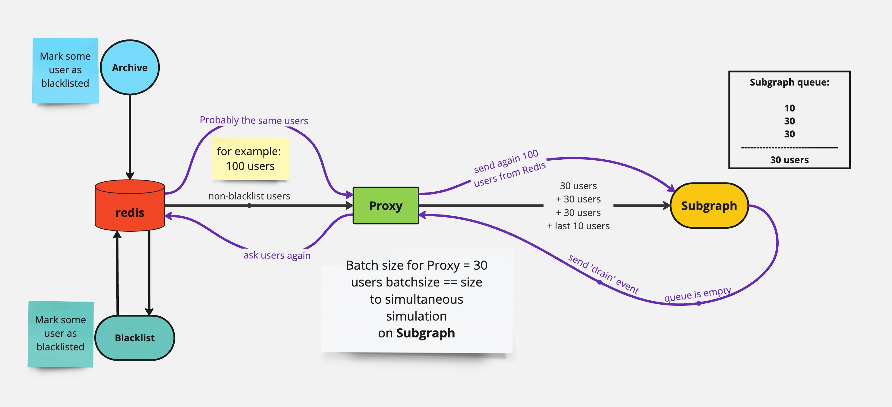

### Subgraph

Subgraph is a service that filters users for further liquidation. Subgraph focuses on users with HF, MinBorrow, and MinCollateral values close to liquidation possibility. Its main task is to filter users and, if their HF is close to liquidation, send them to DataFetcher.

#### Main Principles of Subgraph Operation

1. **Initialization**:

   - Subgraph receives users from Proxy for further filtering.

2. **User Filtering**:

   - Subgraph filters users with Health Factor (HF) parameters from 0.5 to 2 (input filters). Users with significantly higher or lower HF were rejected at the Blacklist stage.
   - Filter settings in Subgraph are close to potential liquidations. For example, HF in Subgraph is filtered from 0.9 to 1.1 (output filters).

3. **Processing and Circle Completion Speed**:

   - If there are 10 thousand users on the Compound protocol, a circle is the time it takes to process all these users.
   - On our production service, a circle in Subgraph takes about 1.5 minutes, which is a very good result.

4. **Interaction with DataFetcher**:

   - Subgraph sends users to DataFetcher for final decision on liquidation. For example, if a user has HF 0.95, Subgraph sends them to DataFetcher in the execute/liquidate topic to calculate the profitability of liquidation.
   - DataFetcher can only liquidate users that Subgraph sends to it in real-time. Therefore, the speed of processing the user circle by the Subgraph service is very important.

5. **Circle Scanning**:
   - If a user's parameters remain within the Subgraph's output filters (for example, HF 0.95), they will be constantly sent to DataFetcher until they are liquidated or until their parameters go beyond the filters.

## Conclusion

Subgraph provides accurate and fast filtering of users for further liquidation, taking into account all necessary parameters. The service is somewhat similar to Blacklist, but the speed of filtering is important for it.
