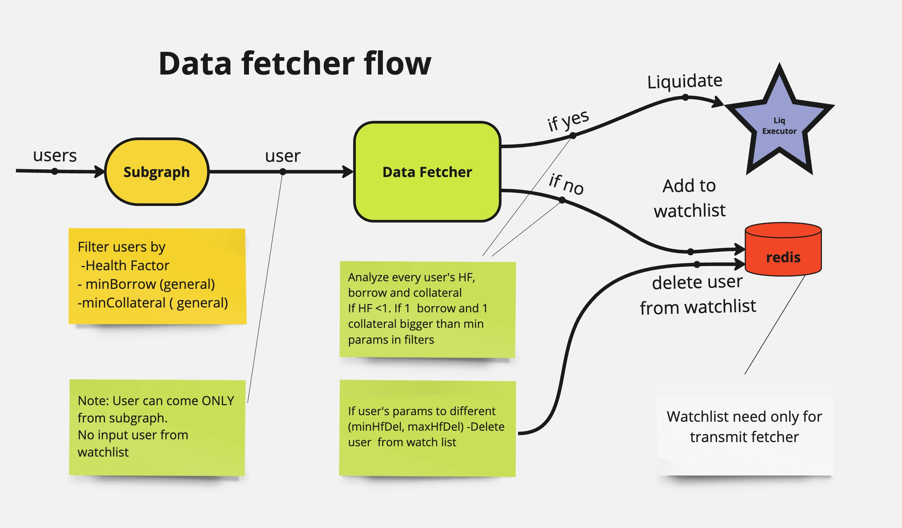

# DataFetcher

DataFetcher is one of the final services in the system. Its main task is to make decisions about liquidating users or adding them to the WatchList for further monitoring. DataFetcher works together with Subgraph and can be both a final service and pass users to TransmitFetcher for further processing by adding users to the Redis Watchlist.

## Main principles of DataFetcher operation

### 1. Initialization:

- DataFetcher accepts users only from the Subgraph service. It does not have mechanisms for reading users (at the input) from databases (Redis).
- However, DataFetcher has a mechanism for working with Redis at the output. After processing users, DataFetcher decides whether to add users to the WatchList in Redis or not.

### 2. User analysis:

- DataFetcher analyzes the user's HF, as well as all tokens that are in the user's Borrow and Collateral. It selects the largest token for liquidation (Best Borrow and Best Collateral), as we can only liquidate one Borrow and one Collateral per user.
- For example, at the Subgraph stage, we check MinBorrow and MinCollateral for users. If the MinBorrow value is 0.1 ETH, Subgraph passes the user further to DataFetcher. However, DataFetcher checks all tokens of the user and may see that the user has three tokens in Borrow. It selects the largest token for liquidation.
- If the largest of these Borrows is less than MinBorrow (for example, less than 0.1 ETH), such a user will not be liquidated.

### 3. Filters in parameters:

- MinHfDel and MaxHfDel: If DataFetcher sees that the user's Health Factor is less than MinHfDel or greater than MaxHfDel, it removes such a user from the WatchList.
- MinHfLiq and MaxHfLiq: If the user's Health Factor is between MinHfLiq and MaxHfLiq, the user will be sent for liquidation. For example, if MaxHfLiq = 1 and MaxHfDel = 1.2, it means that if the user's Health Factor is from 1 to 1.2, they will remain in the WatchList. If it's more than 1.2, the user will be removed from the WatchList.
- MinBorrow and MinCollateral: Unlike Subgraph, where MinBorrow and MinCollateral mean Total MinBorrow (total borrow value across all tokens in the user's borrow), in DataFetcher these parameters define the value for one largest borrow and one largest collateral.

### 4. Decision making:

- If a user is suitable for liquidation (for example, Health Factor < 1), DataFetcher sends a liquidate event (execute/liquidator/${protocol}) to LiqExecutor.
- If a user is not suitable for liquidation, DataFetcher adds them to the WatchList in Redis for further monitoring. For example, if the user's Health Factor > 1 or their minimum Borrow/Collateral is not suitable for liquidation, DataFetcher adds them to the WatchList.
- DataFetcher also removes users from the WatchList if their parameters have changed and they no longer meet the criteria for monitoring or liquidation.

### 5. Monitoring and updating:

- Users from the WatchList will be monitored by TransmitFetcher.
- DataFetcher constantly checks users coming from Subgraph and takes appropriate actions (for example, liquidation or removal from the WatchList).

## Note

As described in the Subgraph section, if a user meets the liquidation criteria (for example, Health Factor 0.95), Subgraph will constantly send this user to DataFetcher every one and a half minutes until the user is liquidated. Therefore, DataFetcher may often receive the same user. If DataFetcher decides not to liquidate this user, they will still pass on the next step from Subgraph.

## Conclusion

DataFetcher provides detailed user analysis and makes decisions about their liquidation or addition to the WatchList for further monitoring. Its functionality allows checking each individual borrow and collateral of the user. And based on their parameters, it sends users for liquidation or adds them to the Watchlist for further observation by the TransmitFetcher service.
