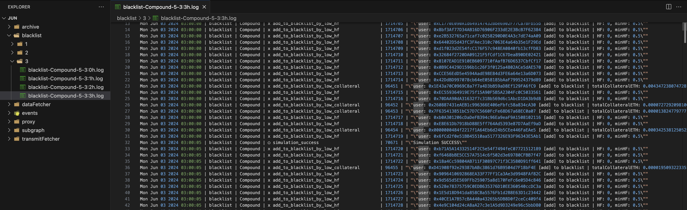

### Логування

#### Загальний опис

У нашій системі кожен сервіс відправляє необхідні логи на окремий сервіс логування (логер). Відправка логів здійснюється за допомогою топіку `logger/liquidator`. Основна мета логування – це моніторинг і аналіз дій сервісів, зокрема, фільтрації і ліквідації користувачів.

#### Мета логування

Хоча логи про помилки також відправляються на логер, основна задача логування полягає у наступному:

1. **Переглядав ліквідованих юзерів:**

   - Ліквідація користувачів: Моніторинг процесу успішних ліквідацій користувачів. Якщо користувач не був ліквідований, логер дозволяє з’ясувати, на якому етапі процесу він був пропущений.

2. **Пошук причини чому ліквідація не відбулася:**

   - Аналіз навантаження кожного сервісу, час проходження кола на кожному сервері, вимірювання часу для кожної операції. Також в логах можна знайти всіх юзерів, що є у нас на кожному протоколі.

3. **Логування помилок**
   - Логування помилок, діагностика проблем, забезпечення цілісності даних.

#### Логування даних

Логування відбувається у кореневому сервісі за допомогою методу `fetcher.on`. Цей метод приймає два параметри:

- `data`: Інформація для логування.
- `ev` (опціонально): Назва події. Якщо цей параметр не задано, використовується значення за замовчуванням `INFO`.

Приклад використання:

```javascript
fetcher.on("info", (data, ev = INFO) => {
  $.send("info", {
    service,
    protocol,
    ev,
    data: JSON.stringify(data),
  })
})
```

#### Список ліквідованих позицій

Список ліквідованих позицій можна дивитись на сайті [EigenPhi](https://eigenphi.io/mev/ethereum/liquidation). Просто скопіюй адресу юзера "borrower", відкрий лог файли за допомогою VS Code і встав адресу в глобальний пошук. Так ти побачиш, чи сталася ліквідація. І якщо не сталася, то на якому етапі вона не сталась.

**Поради по перегляду логів в VS Code:**

1. Якщо в тебе логів забагато, то ти можеш збільшити ліміт пошуку в VS Code з 20000 до 1000000, наприклад.
2. Лог файли дуже важкі (файл за 1 годину може важити до 100 мб). Якщо напряму на лог сервері переглядати файли дуже довго, то ти можеш викачати логи собі на компʼютер (вночі, наприклад) і переглядати їх локально. Для цього можеш використовувати команду `rsync`.

#### Використання команди `this.emit`

Команда `this.emit("info", message, ev="SIMULATION_ERROR")` використовується для логування. `ev` - це назва події, яка відправляється на логер.

`this.emit` доступний у всіх підкласах сервісу. Не соромся використовувати його.

**Важливе доповнення:**
Май на увазі, що `this.emit("info")` чи `this.emit("error")` використовується для логування, і їх видалення чи заміна не вплине на роботу сервісу, лише на логи. Проте в коді сервісів також трапляються службові методи, наприклад `this.emit("fetch")` чи `this.emit("sendUserToDataFetcher")` - їх необдумана зміна чи видалення поламає роботу сервісу. Не попадайся на це, бо це ті граблі, на які я наступав декілька разів!


