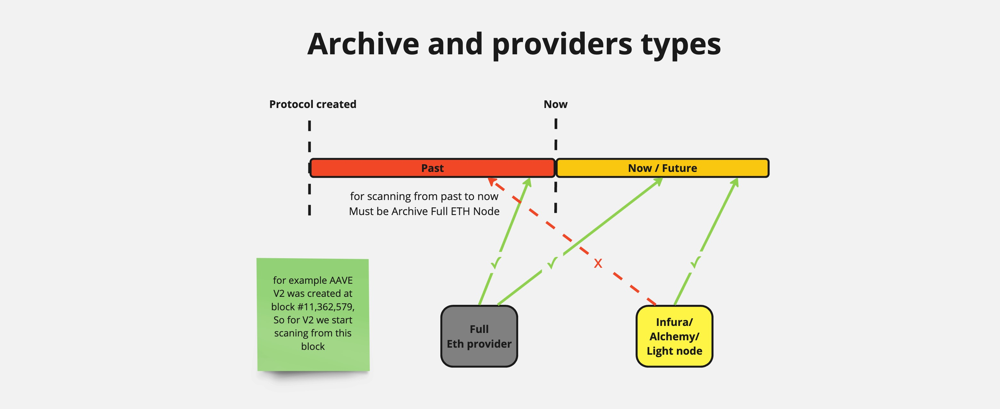

# Архів (Archive)

Задача архіву – зібрати всіх користувачів, які коли-небудь взаємодіяли з кожним окремим протоколом.

## Як працює архів?

### 1. Ініціалізація:

- Наприклад, розглянемо протокол AAVE V2. AAVE V2 був створений три роки тому на певному блоці (наприклад, блок №11,362,579).
- Ми запускаємо сервіс архіву, який в конфігурації має початковий номер блоку, вказаний вручну (номер створення протоколу).

### 2. Сканування історичних даних:

- Архів починає сканувати з цього блоку, фільтруючи всі взаємодії зі смарт-контрактами AAVE V2.
- Він аналізує, які користувачі та адреси взаємодіяли з протоколом з моменту його створення до сьогоднішнього дня.
- Під час сканування архів записує всіх користувачів у Redis.

### 3. Поточний стан:

- Станом на зараз, архів зібрав приблизно:
  - 30 тисяч користувачів у Compound
  - 18 тисяч у AAVE V3
  - 54 тисяч у AAVE V2
  - 10 тисяч у AAVE V1

### 4. Моніторинг нових користувачів у реальному часі:

- Архів також перевіряє нових користувачів у реальному часі.
- Кожен новий блок приходить з сервісу Events, і якщо в ньому є взаємодії користувача з протоколом, ця інформація також записується у Redis.

Цей процес дозволяє нам підтримувати актуальний список користувачів для подальшого відслідковування їхніх Health Factor та інших параметрів.

> **Важливо:** Для сканування користувачів у минулих блоках нам потрібна архівна full Ethereum нода (Example: Geth). Ноди типу Infura чи Alchemy зазвичай зберігають лише попередні кілька десятків блоків (окрім платних підписок, або спеціальних провайдерів). Але якщо Redis з користувачами заповнений, можна використовувати хмарну ноду для моніторингу нових користувачів у режимі реального часу.
