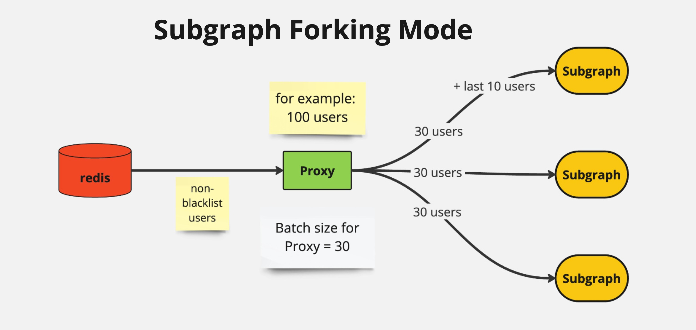

### Proxy

Proxy – це допоміжний сервіс для Subgraph. Він з’явився через необхідність ефективного розподілу користувачів між декількома інстансами Subgraph.

#### Історія

Наша архітектура Cinnamon дозволяє запускати кожен сервіс у режимі декількох форків. Наприклад, Subgraph може бути запущено з 10, 20 або більше форками для підвищення продуктивності. Задача Proxy полягала в тому, щоб ефективно розподіляти користувачів між цими форками. Однак, після оптимізації та переходу на використання симулятора, написаного на Rust (Rust = fast:), замість звичайної Ethereum ноди, швидкість значно збільшилася, і тепер всі сервіси працюють у режимі одного форка. Тому немає потреби запускати кілька інстанцій Subgraph.

Проте наразі взаємодія між сервісами Proxy і Subgraph дуже добре віддебажена і працює ефективно. Але комбінація Proxy і Subgraph дозволяє нам в майбутньому зменшити коло сканування шляхом запуску декількох форків з використанням різних інстанцій симулятора.

#### Основні принципи роботи Proxy

1. **Ініціалізація**:

   - Proxy дістає всіх користувачів з Archive. Наприклад, на протоколі Compound є 50 тисяч користувачів.
   - Proxy перевіряє, які з цих користувачів є в Blacklist, а яких немає. Наприклад, якщо з 50 тисяч користувачів 10 тисяч не знаходяться в Blacklist, Proxy відправляє цих користувачів на Subgraph для подальшої обробки.

2. **Розподіл користувачів**:

   - Proxy відправляє користувачів на Subgraph батчами. Розмір батчу можна встановити в налаштуваннях (зараз це 30 користувачів).
   - Важливо: Весь батч йде на перевірку в симулятор. Симулятор має обмеження по максимальному розміру газу і не може обробити більше 30-40 користувачів. Тому не встановлюйте розмір батчу більше 30-40. Малий розмір батчу просто сповільнить сервіс. Примітка: Для дебагінгу сервісу Subgraph зручно встановити розмір батчу в 1 користувача.
   - Якщо запущено 10 форків Subgraph, і є 10,000 non-Blacklist користувачів, Proxy рівномірно розподіляє користувачів між всіма форками. Тобто на кожен форк буде відправлено по 1,000 користувачів. Тобто 30 юзерів на перший форк, 30 на другий, поки не відправляться всі 10000/30 = 334 батчі, по 33-34 батчі на кожен форк.

   

3. **Обробка та зворотний зв’язок**:

   - Proxy відправляє користувачів на Subgraph за лічені секунди. І далі користувачі попадають у чергу в сервісі Subgraph. Після обробки всіх користувачів, Subgraph відправляє сигнал (event drain) на Proxy, що вказує на завершення обробки і готовність до прийому нових батчів.
   - Proxy дістає оновлений список користувачів на кожному наступному колі, враховуючи можливі зміни в Archive або Blacklist, і відправляє наступний батч користувачів на Subgraph.

   

4. **Запуск та налаштування**:
   - Subgraph завжди повинен бути запущений перед Proxy, інакше Proxy просто відправить користувачів у пустоту, і ми не отримаємо drain event.
   - Захист: Якщо Proxy не отримає event drain протягом години (параметр "SEND_WITHOUT_DRAIN_TIMEOUT": 3600000 (ms)), Proxy відправить батчі на Subgraph. Це робить захист у випадку, якщо на продакшені перезавантажать тільки сервіс Subgraph без Proxy. Не встановлюйте параметр SEND_WITHOUT_DRAIN_TIMEOUT занадто малим, інакше це може створити проблему накопичення занадто великої кількості користувачів в інстанціях Subgraph. Значення в 3600000 (ms) є доволі безпечним, оскільки станом на зараз Subgraph проходить коло за 90 секунд.
