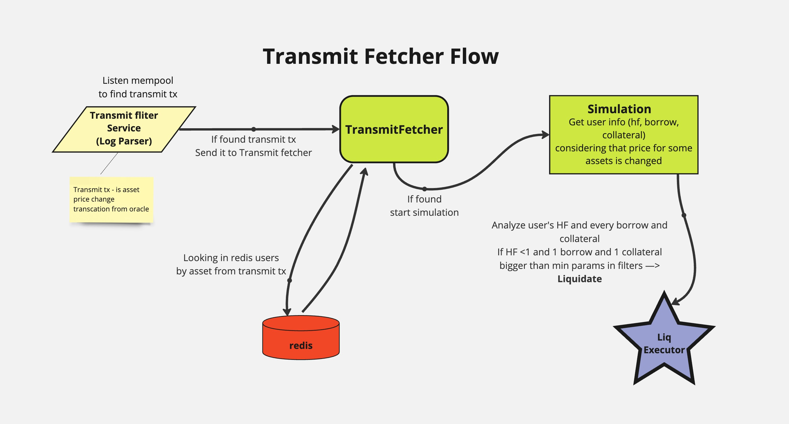
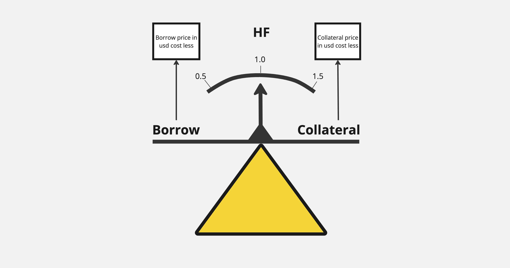

# TransmitFetcher

TransmitFetcher – це сервіс, який слухає Transmit транзакції з mempool. Щоб виявити зміни цін на токени, які є у користувача в borrow або в collateral, що впливають на Health Factor користувачів. TransmitFetcher дає можливість ліквідувати користувача в тому ж блоці, де змінюється його Health Factor. По суті, це як дивитись в майбутнє на один блок.

## Що таке Transmit:

- Transmit – це транзакція від Oracle провайдера Chainlink, яка повідомляє протоколу ліквідності про зміну ціни активу. Вона необхідна для безперебійної роботи протоколів ліквідності.
- Приклад роботи: якщо зараз ETH коштує 4000 доларів, а через годину ETH коштує 3950 доларів, то через годину Transmit відправляє нову ціну протоколу ліквідності.
- Вплив на Health Factor: якщо користувач взяв кредит у WrapedBTC і поклав WrapedETH як заставу, зміна ціни WrapedBTC або WrapedETH вплине на його Health Factor.
- Частота: Transmit надходить у певний інтервал (наприклад, раз на годину) або при значних змінах ціни, і передає нову ціну токену до протоколу ліквідності.

## Принципи роботи TransmitFetcher:

### 1. Моніторинг Transmit:

- TransmitFetcher слухає транзакції Transmit, які надходять від іншого сервісу (logParser), що займається фільтрацією всього мемпулу.
- TransmitFetcher перевіряє, чи стосується Transmit його протоколу (V1, V2, V3, Compound) і які токени змінюються в ціні.

### 2. Аналіз користувачів:

- TransmitFetcher дістає з WatchList усіх користувачів, у яких згадуваний токен є в Borrow або Collateral.
- Для кожного користувача симулює транзакцію з урахуванням Transmit транзакції, тобто з урахуванням зміни ціни. Це дає змогу отримати новий Health Factor ще на етапі mempool до включення в блок.

### 3. Прийняття рішень:

- Якщо новий Health Factor користувача < 1, TransmitFetcher відправляє подію liquidate для LiqExecutor.
- TransmitFetcher перевіряє всі токени в Borrow і Collateral у користувача перед прийняттям рішення про ліквідацію.
- TransmitFetcher не записує або видаляє користувачів з WatchList, він тільки дістає користувачів з WatchList для аналізу. Записом та видаленням користувачів з WatchList займається сервіс DataFetcher.

### 4. Переваги TransmitFetcher:

- Найбільші і найприбутковіші ліквідації відбуваються саме через TransmitFetcher, оскільки він моніторить мемпул і може передбачати зміни цін.

## Висновок

TransmitFetcher забезпечує моніторинг та аналіз змін цін на токени, які впливають на Health Factor користувачів. Його основне завдання – своєчасно виявляти користувачів, які можуть бути ліквідовані, і передавати цю інформацію для подальших дій.
